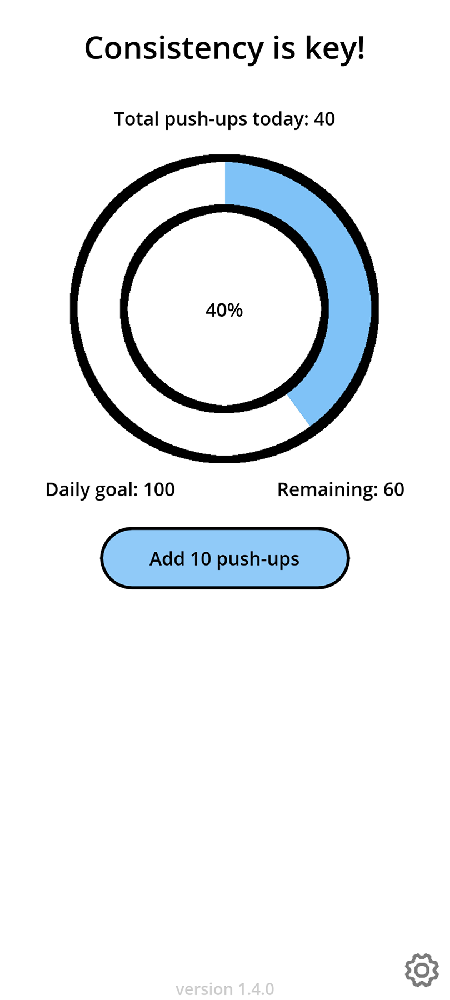
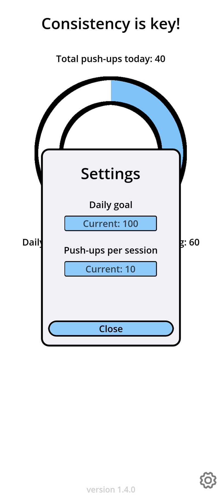
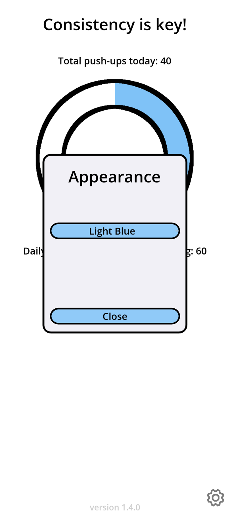
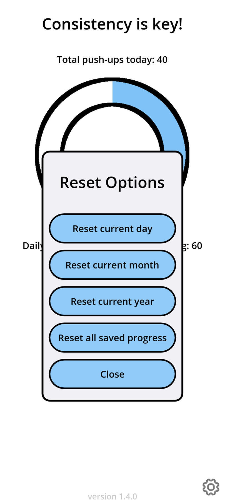

  

<h1 align="center">Push-Up Progression</h1>

  
  
  

  An app for tracking push-up progress and reaching daily goals.

  Created with <a href="https://godotengine.org/" target="_blank">Godot Game Engine [4.3.beta2]</a>.

<h4 align="center">
  <a href="#screenshots">Screenshots</a> •
  <a href="#roadmap">Roadmap</a> •
  <a href="#usage">Usage</a> •
  <a href="#license">License</a>

## Screenshots

| Main page | Settings |
|:---:|:---:|
|  |  |
| Appearance | Reset options |
|  |  |

## Roadmap
* ~~Implement pop-up confirmation for resetting saved progression~~
* ~~Provide reset options for saved progression~~
* ~~Custom daily goals & pushups per session option~~
* ~~Integrate logging system for saving and loading processes~~
* ~~Add notification for saved progression status~~
* Show previous progression
* Visual theme update

## Usage

Android

You can install Push-Up Progression by using [Obtainium](https://github.com/ImranR98/Obtainium/) for automatic updates, or manually if you prefer direct downloads.

Install with Obtainium

1. [Download](https://github.com/ImranR98/Obtainium/releases/latest) and install Obtainium.
2. Open Obtainium and tap `Add App` from the bottom tab bar.
3. Enter `PushupProgression` in the search field, tap `Search`, select `GitHub` as the source, and then tap `Select 1`.
4. Choose `Vandreic/PushupProgression` from the results and tap `Pick`.
5. At the top of the screen, next to the GitHub URL, tap the `Add` button to confirm.
6. At the bottom bar, tap `Install` to begin the installation.

Update through Obtainium

When new updates are released, Push-Up Progression can be updated via Obtainium.

1. Open Obtainium.
2. To update Push-Up Progression:
   * Tap the "update icon" (phone with downward arrow) next to `PushupProgression by Vandreic`.
    ***or*** 
   - Select `PushupProgression` from the app list and tap `Update` from the bottom bar.

**Note:** Obtainium supports automatic updates, allowing apps to be updated seamlessly in the background. This feature is enabled by default and ensures that Push-Up Progression stays up-to-date. For more details, visit the [Obtainium wiki](https://github.com/ImranR98/Obtainium/wiki#background-updates).

Manual Installation

1. [Download](https://github.com/Vandreic/PushupProgression/releases/latest) the latest release.
2. Install the app and run.

Manual Update

When new updates are released, you need to manually [download](https://github.com/Vandreic/PushupProgression/releases/latest) the latest release and install it over the existing installation. 
  
**Note:** If Push-Up Progression is installed via Obtainium, updates can be downloaded and installed automatically.

Windows

1. [Download](https://github.com/Vandreic/PushupProgression/releases/latest) the latest release.
2. Run the executable.

macOS / iOS / Linux

Push-Up Progression hasn't been compiled for macOS, iOS, or Linux, but you can compile the source code yourself if desired.

## License
Push-Up Progression is released under the [GNU General Public License v3.0](LICENSE.md).
