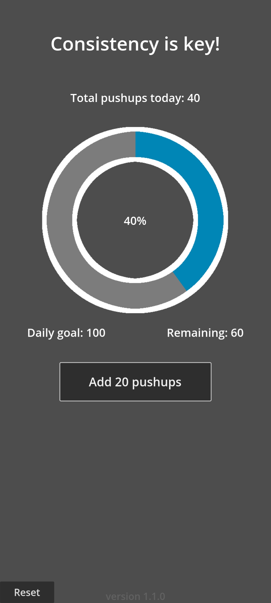

# ***PushupProgression***

An app for tracking pushup progress and reaching daily goals. Designed for smartphones.

Created with [Godot Game Engine [4.3.dev5]](https://godotengine.org/).

 

## Roadmap
* ~~Implement pop-up confirmation for resetting saved progression~~
* ~~Provide reset options for saved progression~~
* ~~Custom daily goals & pushups per session option~~
* ~~Integrate logging system for saving and loading processes~~
* ~~Add notification for saved progression status~~
* Show previous progression
* Visual theme update

## Usage

Android

1. [Download](https://github.com/Vandreic/PushupProgression/releases/latest) the latest release.
2. Install the app and run.

Windows

1. [Download](https://github.com/Vandreic/PushupProgression/releases/latest) the latest release.
2. Run the executable.

macOS / iOS / Linux

PushupProgression  hasn't been compiled for macOS, iOS, or Linux, but you can compile the source code yourself if desired.

## License
PushupProgression is released under the [MIT License](LICENSE.md).
